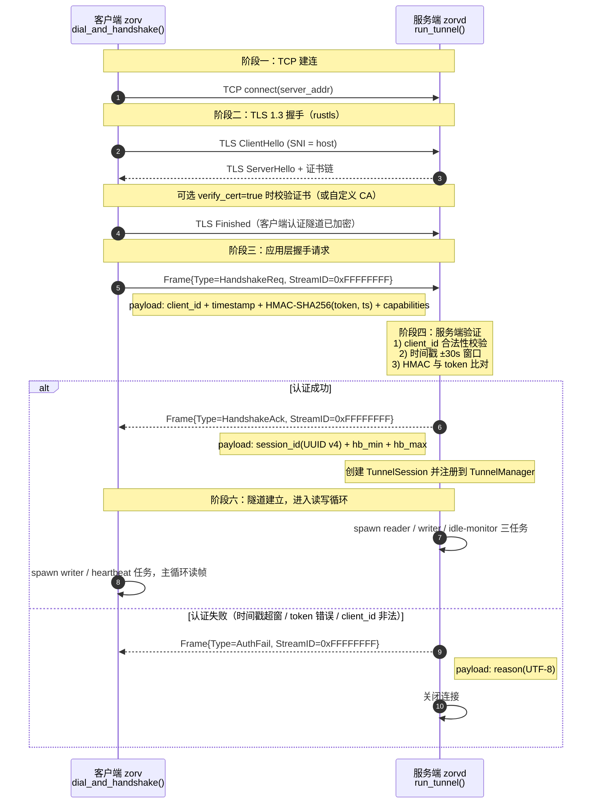
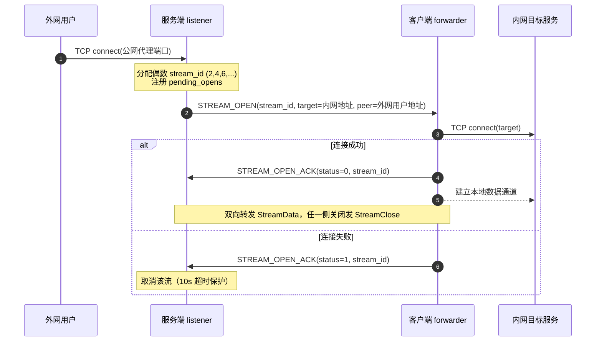

# Zorv 客户端/服务端握手流程详解

> 本文档完整描述 Zorv（Rust 自研协议内网穿透）中**客户端 `zorv`** 与**服务端 `zorvd`** 从 TCP 建连、TLS 1.3 握手、应用层认证握手，到隧道建立后运行（心跳、业务流、断开清理与重连）的完整流程。
>
> 相关源码索引：
>
> - 客户端握手入口：[dialer.rs](../src/client/dialer.rs)
> - 客户端主循环：[client/mod.rs](../src/client/mod.rs)
> - 服务端握手入口：[server/tunnel.rs](../src/server/tunnel.rs)
> - 服务端隧道监听：[server/mod.rs](../src/server/mod.rs)
> - 握手协议编解码：[protocol/handshake.rs](../src/protocol/handshake.rs)
> - 帧编解码：[protocol/frame.rs](../src/protocol/frame.rs)
> - 多路复用（业务流帧）：[protocol/multiplex.rs](../src/protocol/multiplex.rs)
> - 认证工具：[server/auth.rs](../src/server/auth.rs) / [common/crypto.rs](../src/common/crypto.rs)

---

## 1. 总体工作方式

```
 外网用户 ──▶ 服务端 zorvd（公网服务器）                   客户端 zorv（内网机器）
              ┌───────────────────────────┐              ┌────────────────────────┐
              │  public listener(代理端口) │              │  本地 forwarder        │
              │       │                   │              │        │               │
              │  STREAM_OPEN/ACK/DATA     │   TLS 1.3    │  STREAM_OPEN/ACK/DATA  │
              │  （业务流多路复用）         │◀═══隧道═══▶│  （业务流多路复用）      │
              │       ▲                   │  自研帧协议    │        │               │
              │       │                   │  单连接承载     │        ▼               │
              │  tunnel accept            │  多条业务流     │  本地 TCP/UDP 目标     │
              │  （握手认证入口）           │              │  （如 127.0.0.1:8080）  │
              └───────────────────────────┘              └────────────────────────┘
```

核心思想：

- **单条长连接**：客户端主动拨号服务端 `tunnel_addr`，建立一条 TLS 1.3 加密隧道，此后所有业务流（多路复用）都通过这条隧道上的独立 Stream 承载。
- **客户端主动连接，服务端反向下发目标**：客户端无需声明转发目标；外网用户访问服务端公网端口时，服务端通过 `STREAM_OPEN` 帧把「本地目标地址」下发给客户端，客户端据此连接内网目标。
- **握手分两层**：传输层 TLS 1.3 握手 + 应用层自定义帧认证握手（HMAC-SHA256 + 时间戳防重放）。

---

## 2. 协议基础（帧格式）

所有隧道数据都封装在自定义二进制帧中（小端序）：

```
| Magic(2B, 0x5A3C) | Version(1B, 0x01) | Type(1B) | StreamID(4B) |
| PayloadLen(4B) | Payload(变长) | PaddingLen(2B) | Padding(变长) | Checksum(4B, CRC32) |
```

- `CRC32` 覆盖从 Magic 到 Padding 的全部字节（不含自身）。
- 控制帧（握手、心跳、错误等）使用固定 `StreamID = 0xFFFF_FFFF`。
- 业务流帧（StreamOpen/Data/Close/UdpDatagram）使用各自分配的 StreamID。

帧类型（`FrameType`，见 [frame.rs](../src/protocol/frame.rs#L32-L45)）：

| 类型            | 值   | 说明                          |
| --------------- | ---- | ----------------------------- |
| `HandshakeReq`  | 0x01 | 客户端握手请求                |
| `HandshakeAck`  | 0x02 | 服务端握手成功应答            |
| `AuthFail`      | 0x03 | 服务端认证失败应答            |
| `StreamOpen`    | 0x10 | 服务端→客户端：请求建立业务流 |
| `StreamOpenAck` | 0x11 | 客户端→服务端：业务流建立结果 |
| `StreamData`    | 0x12 | 业务流数据                    |
| `StreamClose`   | 0x13 | 业务流关闭                    |
| `Heartbeat`     | 0x20 | 心跳（客户端发送）            |
| `HeartbeatAck`  | 0x21 | 心跳应答（服务端回复）        |
| `UdpDatagram`   | 0x30 | UDP 数据报                    |
| `Probe`         | 0xFE | 探测                          |
| `Error`         | 0xFF | 服务端踢出/错误通知           |

---

## 3. 完整握手时序



---

## 4. 各阶段详细说明

### 4.1 阶段一：TCP 建连

客户端在 [dial_and_handshake()](../src/client/dialer.rs#L41-L44) 中调用 `TcpStream::connect(&config.server_addr)`，建立到服务端 `tunnel_addr`（如 `0.0.0.0:8443`）的 TCP 连接。

服务端在 [server/mod.rs](../src/server/mod.rs#L95-L149) 中启动隧道监听循环，`accept` 到新连接后，**先做 IP 白名单检查**（`auth.allowed_ips`，支持精确 IP 与 IPv4 CIDR），不在白名单内直接拒绝；通过后 spawn `run_tunnel` 处理该连接。

> 注意：IP 白名单检查发生在 TLS 握手之前，属于传输层的预过滤。

### 4.2 阶段二：TLS 1.3 握手

双方都使用纯 Rust 的 `rustls`（经 `tokio-rustls` 集成），协议版本强制 TLS 1.3：

- 服务端：[build_server_acceptor()](../src/common/tls.rs#L109-L144) 从 PEM 加载证书链与私钥，构建 `TlsAcceptor`。
- 客户端：[build_client_connector()](../src/common/tls.rs#L155-L197)：
  - `verify_cert = true`：必须配置 `ca_file`，将自定义 CA 加入根证书库并正常校验。
  - `verify_cert = false`：使用 `InsecureVerifier` 跳过所有证书校验（仅限测试/自签场景）。

客户端从 `server_addr` 中剥离端口得到 host，构造 `ServerName`（解析失败时回退 `localhost`），随后 `connector.connect(server_name, tcp)` 完成 TLS 握手（见 [dialer.rs](../src/client/dialer.rs#L51-L66)）。

服务端在 [run_tunnel()](../src/server/tunnel.rs#L66-L68) 中 `acceptor.accept(tcp)` 完成服务端侧 TLS 握手，并将 `TlsStream` split 为读写两个半部。

### 4.3 阶段三：应用层握手请求（HANDSHAKE_REQ）

TLS 握手完成后，客户端立即序列化并写出第一个控制帧（[dialer.rs](../src/client/dialer.rs#L68-L75)）：

```rust
let req = HandshakeReq::build(&config.client_id, &config.auth.token, "tcp");
let req_frame = req.into_frame();          // FrameType::HandshakeReq, StreamID=0xFFFFFFFF
req_frame.encode(&mut enc);
tls_stream.write_all(&enc).await?;
tls_stream.flush().await?;                  // 显式 flush，确保立即发出
```

`HandshakeReq` 的 payload 布局（小端序，见 [handshake.rs](../src/protocol/handshake.rs#L7-L18)）：

```
| client_id_len: u16 | client_id: bytes | version_len: u16 | version: bytes |
| timestamp: u64(毫秒) | hmac: 32 bytes | capabilities_len: u16 | capabilities: bytes |
```

字段说明：

| 字段           | 生成逻辑                                                        |
| -------------- | --------------------------------------------------------------- |
| `client_id`    | 配置文件中的客户端唯一标识，与服务端代理规则绑定                |
| `version`      | 客户端自身版本号（`env!("CARGO_PKG_VERSION")`，如 `1.1.1`），由 `HandshakeReq::build` 自动注入 |
| `timestamp`    | `now_millis()`（Unix 毫秒时间戳）                               |
| `hmac`         | `HMAC-SHA256(token, timestamp 的 8 字节小端表示)`，固定 32 字节 |
| `capabilities` | 当前固定为 `"tcp"`                                              |

> 关键点：HMAC 的 key 是共享 token，消息是**时间戳本身**，因此同一 token 下每个时间戳的签名不同，配合时间戳窗口即可防重放。

### 4.4 阶段四：服务端验证

服务端循环读取并解码出第一个帧（[tunnel.rs](../src/server/tunnel.rs#L70-L94)），然后依次做四道校验：

**1) 帧类型与 payload 解析**（[parse_handshake_req](../src/protocol/handshake.rs#L256-L263)）：帧类型必须是 `HandshakeReq`，否则直接关闭连接。

**2) client_id 合法性**（[validate_client_id](../src/server/auth.rs#L52-L58)）：长度 1~64，且不允许控制字符、空白以及 `< > & " '` 等 HTML 危险字符（防 XSS/注入进入管理台）。非法则回复 `AuthFail("invalid client_id")` 并关闭。

**3) 版本校验**（[verify_version](../src/protocol/handshake.rs#L233-L245)）：客户端上报的 `version` 必须与服务端自身版本（`env!("CARGO_PKG_VERSION")`）**完全一致**，不一致则回复 `AuthFail("version mismatch: client=... server=...")` 并关闭——不同版本的客户端禁止连接。

**4) 认证**（[authenticate → verify_handshake](../src/protocol/handshake.rs#L222-L231)）：

- 时间戳窗口：`|now - timestamp| <= 30s`（`TIMESTAMP_WINDOW_SECS`），超窗返回 `Auth("timestamp out of window")`。
- HMAC 校验：服务端用当前共享 token 对 `timestamp` 重新计算 `HMAC-SHA256`，与帧内 32 字节比对，不一致返回 `Auth("invalid token")`。

> 共享 token 放在 `Arc<RwLock<String>>` 中，管理台可动态修改并热生效。

### 4.5 阶段五：服务端应答

**认证成功**（[tunnel.rs](../src/server/tunnel.rs#L119-L149)）：

1. 生成会话 ID：`Uuid::new_v4().to_string()`。
2. 构造 `HandshakeAck` 并写出（`session_id` + 心跳区间 `hb_min`/`hb_max`，服务端默认 `25/55` 秒）。
3. 创建 `TunnelSession`（内含 `frame_tx` 发送通道、流表、pending 打开表、服务端偶数 StreamID 分配器、流量计数等），`manager.register()` 注册到 `client_id → session` 映射。
4. spawn 三个后台任务（见第 5 节）。

`HandshakeAck` payload 布局（[handshake.rs](../src/protocol/handshake.rs#L17-L22)）：

```
| session_id_len: u16 | session_id: bytes(UUID v4 字符串) | heartbeat_min: u32(秒) | heartbeat_max: u32(秒) |
```

**认证失败**（[tunnel.rs](../src/server/tunnel.rs#L196-L204)）：

构造 `AuthFail` 帧（payload 为 `reason_len: u16 + reason: bytes`），写出后关闭连接。常见原因：

- `invalid client_id`
- `timestamp out of window`
- `invalid token`

### 4.6 阶段六：客户端接收应答

客户端读取服务端返回的第一个帧并分发（[dialer.rs](../src/client/dialer.rs#L77-L111)）：

- `HandshakeAck`：解析出 `session_id`、`heartbeat_min/max`，**握手成功**，返回 `(TlsStream, HandshakeAck)` 给主循环。
- `AuthFail`：返回 `ZorvError::Auth("rejected by server")`。
- 其它帧类型 / 连接提前关闭（EOF）：返回错误。

随后客户端进入 [run_once()](../src/client/mod.rs#L87-L302)：

1. 用 `ack.heartbeat_min/max` 初始化 `HeartbeatState`。
2. 创建 `frame_tx` 发送通道，split 读写半部。
3. spawn **writer 任务**（独占写半部，从通道取帧编码写出，可加随机 padding）。
4. spawn **heartbeat 任务**（周期性发送 `Heartbeat`，管理 miss 计数）。
5. 主循环独占读半部，解码帧并分发（心跳应答、业务流、踢出等）。

---

## 5. 隧道建立后的运行机制

### 5.1 心跳保活

- 客户端 heartbeat 任务以 `[hb_min, hb_max]` 内随机间隔（`heartbeat_jitter` 关闭时固定为 `hb_min`）发送 `Heartbeat`（payload 为 8 字节毫秒时间戳）。
- 服务端 reader 收到 `Heartbeat` 后，原样回显时间戳构造 `HeartbeatAck`。
- 客户端收到 `HeartbeatAck` 后 miss 计数清零；每发出一个心跳 miss +1；**连续 miss ≥ 3 次（`HEARTBEAT_MISS_MAX`）判定连接死亡**，触发清理与重连（见 [heartbeat.rs](../src/protocol/heartbeat.rs)）。
- 服务端另有 **idle-monitor 任务**：每 5s 检查 `last_activity`，超过 `(hb_max*3 + 10)` 秒无任何帧活动则判定客户端失联，触发清理（[tunnel.rs](../src/server/tunnel.rs#L343-L361)）。

### 5.2 业务流建立（STREAM_OPEN，以 TCP 为例）

握手完成后，隧道即可承载业务流：



- StreamID 约定：**客户端分配奇数（1,3,5…），服务端分配偶数（2,4,6…）**，同一隧道内全局唯一。
- 服务端等待 `STREAM_OPEN_ACK` 有 10 秒超时（[listener.rs](../src/server/listener.rs#L113-L126)）。

### 5.3 踢出与错误通知

管理台「一键踢出」时，服务端发送 `Error` 控制帧（payload 为 UTF-8 原因字符串）。客户端收到后打印原因并 `std::process::exit(0)`（见 [client/mod.rs](../src/client/mod.rs#L251-L257)），**不再重连**。

### 5.4 断开清理与重连

- 任一端检测到断连（EOF、解码错误、心跳死亡、空闲超时）都会触发清理：abort 其余任务 → `manager.unregister_if_current()` 注销会话（只删除 session_id 匹配的会话，防止**重连竞态**误删新会话）→ 流量合并 → 可选 Webhook 离线通知。
- 客户端 `run_once()` 返回后，`run()` 按**指数退避**重连（`initial_delay` 起步、`backoff_factor` 递增、上限 `max_delay`；`max_retries=0` 表示无限重连），见 [client/mod.rs](../src/client/mod.rs#L60-L82)。

---

## 6. 握手失败场景汇总

| 场景                                 | 检测位置                   | 客户端表现                                 |
| ------------------------------------ | -------------------------- | ------------------------------------------ |
| TCP 连接失败 / 服务端未启动          | `TcpStream::connect`       | 返回 IO 错误，进入退避重连                 |
| IP 不在白名单                        | 服务端 accept 后、TLS 前   | 连接被直接丢弃（无响应）                   |
| TLS 证书校验失败（verify_cert=true） | rustls 客户端              | TLS 握手错误，进入退避重连                 |
| 客户端先发非 HandshakeReq 帧         | 服务端 parse_handshake_req | 连接被关闭（EOF）                          |
| client_id 非法（超长/危险字符）      | 服务端 validate_client_id  | 收到 `AuthFail("invalid client_id")`       |
| 客户端/服务端版本不一致              | 服务端 verify_version      | 收到 `AuthFail("version mismatch: ...")`，客户端日志明确提示两端版本 |
| 时间戳超窗（> ±30s）                 | 服务端 verify_timestamp    | 收到 `AuthFail("timestamp out of window")` |
| token 不一致                         | 服务端 HMAC 比对           | 收到 `AuthFail("invalid token")`           |
| 服务端在 ACK 前关闭                  | 客户端读 EOF               | `server closed before handshake ack`       |
| 收到非预期响应帧                     | 客户端帧分发               | `unexpected handshake response frame type` |

---

## 7. 安全机制总结（握手相关）

1. **TLS 1.3 强制**：传输全程加密，指纹与 HTTPS 一致，无自定义协议特征明文暴露。
2. **HMAC-SHA256 + 时间戳防重放**：共享 token 从不明文传输，签名基于时间戳，配合 ±30s 窗口有效防重放。
3. **IP 白名单**：可选 `allowed_ips`（精确 IP / CIDR），在 TLS 之前预过滤。
4. **client_id 输入校验**：防 XSS/注入污染管理台审计与 UI。
5. **动态 token**：管理台可在线修改 token，隧道复用共享 `RwLock` 热生效。

---

## 8. 关键文件速查

| 功能                                    | 文件                                                  |
| --------------------------------------- | ----------------------------------------------------- |
| 客户端拨号 + TLS + 应用层握手           | [client/dialer.rs](../src/client/dialer.rs)           |
| 客户端主循环（读写、心跳、重连）        | [client/mod.rs](../src/client/mod.rs)                 |
| 服务端隧道入口（TLS accept + 握手认证） | [server/tunnel.rs](../src/server/tunnel.rs)           |
| 服务端隧道监听 + IP 白名单              | [server/mod.rs](../src/server/mod.rs)                 |
| 服务端会话管理（注册/查询/竞态保护）    | [server/manager.rs](../src/server/manager.rs)         |
| 握手帧编解码 + 验证                     | [protocol/handshake.rs](../src/protocol/handshake.rs) |
| 帧编解码（Magic/CRC32/padding）         | [protocol/frame.rs](../src/protocol/frame.rs)         |
| 心跳帧与状态机                          | [protocol/heartbeat.rs](../src/protocol/heartbeat.rs) |
| 业务流帧与 StreamID 分配                | [protocol/multiplex.rs](../src/protocol/multiplex.rs) |
| HMAC / 时间戳 / 随机数                  | [common/crypto.rs](../src/common/crypto.rs)           |
| TLS 1.3 配置构建                        | [common/tls.rs](../src/common/tls.rs)                 |
| 认证与 client_id 校验                   | [server/auth.rs](../src/server/auth.rs)               |
